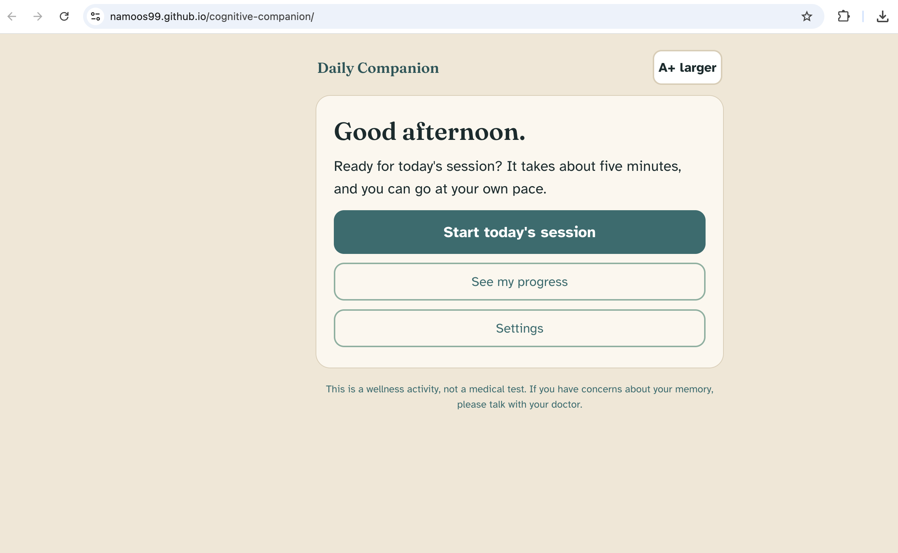
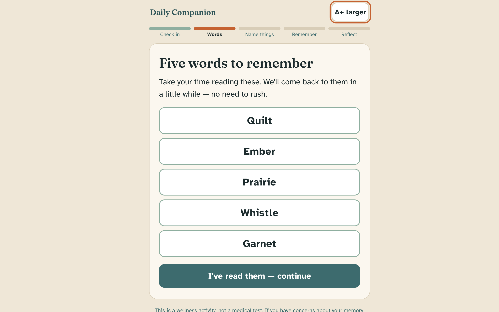
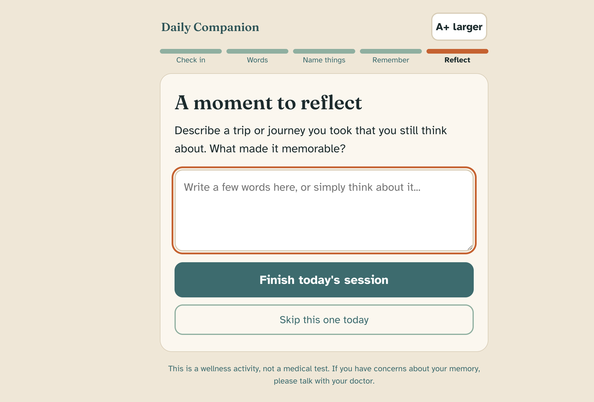

# Daily Companion

**An accessibility-first cognitive wellness app for older adults, powered by Claude.**

A gentle five-minute daily session — a mood and sleep check-in, a delayed word-recall exercise, a verbal fluency task, and a reminiscence prompt — followed by a progress view that celebrates consistency over scores.

> **Live demo:** [namoos99.github.io/cognitive-companion](https://namoos99.github.io/cognitive-companion/)

<p align="center">
  
  
  
</p>

## Why this exists

Evidence that "brain training" prevents dementia is mixed, and this project doesn't pretend otherwise. What is better supported is that regular cognitive engagement, physical activity, sleep, and social connection are associated with healthier cognitive aging. Daily Companion is deliberately framed as a **wellness companion, not a screening or diagnostic tool** — it borrows the *shape* of exercises like delayed recall and verbal fluency because they're engaging and meaningful, without imitating clinical instruments like the MoCA or MMSE.

The design bet is simple: for older adults, the hard part isn't the exercises — it's an interface that respects them. Most brain-training apps are built for 30-year-olds and then shrunk-wrapped in bigger fonts. This one is designed for the 65+ audience from the first pixel.

## Design decisions

Every choice below is intentional and would survive a design review:

- **Atkinson Hyperlegible typeface** — designed by the Braille Institute specifically for low-vision readers, with exaggerated letterform distinctions (e.g., between I, l, and 1).
- **20px base body text** with a persistent A+/A− toggle in the top bar, above the 18px accessibility floor before the user touches anything.
- **Warm sand background, deep forest text** — high contrast without the glare of pure white, which matters for aging eyes. The earthy palette carries over from a companion data-visualization project.
- **One task per screen.** Never a dashboard. Never two questions at once.
- **48px+ tap targets everywhere**, including the recall word grid.
- **No timers.** Timed tasks feel punishing; the verbal fluency exercise is self-paced by design.
- **Forgiving language and no penalties.** Wrong recall picks don't subtract points. The summary celebrates showing up, not the score.
- **Rest days are dots, not gaps.** The progress chart shows missed days as small sage dots with the caption "those are okay too" — consistency is encouraged without guilt mechanics.
- **The distraction interval is real.** The fluency task sits between word presentation and recall on purpose: that's how delayed-recall exercises actually work.
- **Visible keyboard focus and reduced-motion support** are built in, not bolted on.

## Architecture and token strategy

The app is designed to cost almost nothing to run:

- **One small API call per day, maximum.** Claude (Haiku) generates the day's content as a ~400-token JSON payload: five recall words, five decoys, a fluency category, a reminiscence prompt, and a lifestyle nudge. The payload is cached in localStorage so repeat visits the same day make zero calls.
- **All interaction, scoring, and charting run in local JavaScript.** Claude generates; it never grades.
- **A built-in exercise bank is always the fallback.** No API key, a network failure, or a malformed response — the session proceeds identically from local content. The user is never blocked.
- **All personal data stays on-device** in localStorage. Nothing is transmitted anywhere except the optional daily content request to the Anthropic API.

The current build uses a bring-your-own-key pattern (entered in Settings, stored only in the browser). For a multi-user deployment, the call should move behind a small serverless function — see the roadmap.

```
src/
├── App.jsx            # State machine, session flow, persistence wiring
├── screens.jsx        # One top-level component per screen
├── theme.js           # Palette + type scale (all sizes route through the A+ toggle)
├── storage.js         # localStorage helpers (history, settings, daily cache)
├── api/claude.js      # The single daily generation call + payload validation
└── content/fallback.js# Offline exercise bank
```

## Running locally

```bash
npm install
npm run dev
```

Then open the printed local URL. To try Claude-generated daily content, add an Anthropic API key under **Settings** — entirely optional.

## Deploying

The included GitHub Actions workflow deploys to GitHub Pages on every push to `main`. In the repo settings, set **Pages → Source → GitHub Actions** once, and pushes handle the rest.

## Roadmap

- Serverless proxy (Vercel/Netlify function) so no key ever lives in the browser
- Voice input for the reminiscence journal
- Weekly personalized reflection generated from the logged history (one additional API call per week)
- Caregiver-shareable progress summary (opt-in)

## A note on memory concerns

This app is a wellness activity, not a medical test, and it cannot detect or diagnose any condition. If you or someone you love has concerns about memory, the right first step is a conversation with a doctor. In the US, the Alzheimer's Association helpline (1-800-272-3900) is available around the clock.

## License

MIT
